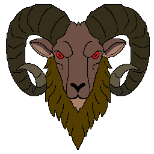

# 🛡️ Masterwatch

A multiplayer game developed using Godot Engine.
**In active development!**

## 💾 How to Run

Download the source according to your OS. **Windows** is the most tested platform by far.

**Windows:**
- Run Masterwatch.exe or Masterwatch.console.exe (for debugging info).

**Linux:**
- Terminal in /Masterwatch/Linux/
- Run the game file by using: `./Masterwatch.x86_64`  
OR  
- Make the Masterwatch.x86_64 file runnable without terminal by using: `chmod +x ./Masterwatch.x86_64`
- Double-click the Masterwatch.x86_64 file in Linux explorer.

**MacOS:**
- Will be added if there's demand for it - please reach out.

## 🤝 Contributing

Contributions are welcome!  
Please contact me (**@.Valiantus** on Discord) if you would like to contribute translations for your language.

By submitting contributions, you agree to:

- Grant the project owner (**Valiantus**) full rights to use your changes in commercial and non-commercial versions.
- Waive claims to ownership or licensing of your submitted IP.
- Be optionally credited in the final release (on request).

## 💌 Credits

Third-party libraries, fonts, or assets used in the project are listed in [`CREDITS`](CREDITS.md).  
Credits for contributions and other help are also located in [`CREDITS`](CREDITS.md).

## 📜 License

### Third-Party Assets

Some external assets are used under separate licenses.  
See [`CREDITS`](CREDITS.md) for attribution.
